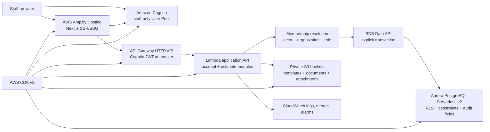

# AWS-Native Backend Architecture

- Status: Proposed architecture for owner approval
- Scope: Account foundation and Estimate Builder Phase 1 replacement
- Baseline: `main` at `5668da67000a8f1bbbd0cee05e9d3bb2384d0658`
Non-goals: Provisioning resources, changing application code, deleting compatibility code, or
beginning Estimate Builder Phase 2

## 1. Executive recommendation

Keep the public and protected Next.js application on **AWS Amplify Hosting**. Build the backend
as a separate **AWS CDK v2** application using:

- **Amazon Cognito User Pools** for staff authentication.
- **Amazon API Gateway HTTP API** with a Cognito JWT authorizer as the application API boundary.
- **AWS Lambda** for account, authorization, estimate, and later document operations.
- **Amazon Aurora PostgreSQL Serverless v2** for relational account and estimate data.
- **RDS Data API** for Lambda-to-Aurora access, including explicit SQL transactions.
- **AWS Secrets Manager** for database credentials and other secrets.
- **AWS Systems Manager Parameter Store** and CDK/CloudFormation outputs for non-secret runtime
  configuration.
- **Amazon S3** for future templates, generated DOCX/PDF files, and attachments.
- **Amazon CloudWatch**, **AWS CloudTrail**, **AWS Backup/RDS backups**, and AWS Budgets for
  operations.

The project owner's infrastructure requirement is non-negotiable for this design: production
hosting, authentication, APIs, compute, databases, secrets, files, monitoring, and backups must
use AWS services. No non-AWS backend or hosting provider is an implementation alternative.

Use `us-west-2` (Oregon) as the primary application region, subject to the owner confirming the
business's AWS account and data-residency requirements. Amplify's CDN is global, and AWS may
place edge components in `us-east-1` as required by the hosting service; the regional backend
remains in `us-west-2`.

The central security rule is:

> A Cognito identity proves who the caller is. An active database membership determines what
> organization and role the caller may use. API input never grants tenant access.

No Supabase resource is required or retained. Existing Supabase code and SQL remain temporary
reference/compatibility artifacts until their AWS replacements pass integration tests.

## 2. Architecture diagram



The browser must not receive database credentials or direct Aurora permissions. Normal
application data access always crosses the API boundary.

## 3. Selected AWS services

| Concern | Selected service | Decision |
| --- | --- | --- |
| Web hosting | AWS Amplify Hosting compute | Continue the existing hosting model for Next.js SSR, static routes, middleware, branch deployments, and CDN delivery. |
| Infrastructure as code | AWS CDK v2 in TypeScript | Use explicit CDK stacks rather than Amplify Gen 2 backend categories. |
| Authentication | Amazon Cognito User Pool | One staff pool per environment; administrator-created users only. |
| API | API Gateway HTTP API + Lambda | Stable backend boundary, JWT validation, throttling, logging, and independently testable authorization. |
| Relational storage | Aurora PostgreSQL Serverless v2 | Preserve foreign keys, checks, exact numerics, revision relationships, and transactions. |
| Database access | RDS Data API | Avoid long-lived application connections and support explicit begin/commit/rollback from Lambda. |
| Secrets | Secrets Manager | Store and rotate the database secret; never expose it to Amplify client code. |
| Non-secret configuration | Parameter Store/CDK outputs | Publish API URL, user-pool ID, app-client ID, region, bucket names, and environment identifiers. |
| Documents | Private Amazon S3 | Versioned object storage with short-lived presigned access. |
| Monitoring | CloudWatch + CloudTrail | Application telemetry and AWS control-plane audit records. |
| Backups | Aurora automated backups/PITR and AWS Backup where needed | Recover database state independently by environment. |

### Why Amplify Hosting remains

The repository is already a mixed public/protected Next.js application. Amplify Hosting supports
Next.js SSR, static pages, API routes, middleware, environment variables, image optimization,
and the App Router. Moving to a hand-built CloudFront/S3/Lambda hosting stack would add
deployment and cache-invalidation work without improving the account or estimate security model.

Amplify Hosting is only the web-hosting choice. It does not dictate the backend data model.

### Why CDK instead of Amplify Gen 2

Amplify Gen 2 is useful when its opinionated auth/data/functions workflow matches the
application. This design deliberately selects API Gateway, Lambda, Aurora PostgreSQL, Data API,
database roles, migrations, and environment isolation. Direct CDK:

- Models those resources and IAM relationships explicitly.
- Avoids bending an AppSync/DynamoDB-oriented data category around a relational domain.
- Supports reviewable CloudFormation changes and environment-specific guardrails.
- Gives Chat 5 one authoritative infrastructure definition.

Amplify Hosting can deploy the frontend while CDK owns the backend. They do not need to be the
same infrastructure abstraction.

## 4. Alternatives considered

### Hosting

**Selected: Amplify Hosting.** It preserves the current public-site deployment and supports the
required Next.js runtime.

**Not selected: custom S3 + CloudFront + Lambda/OpenNext stack.** This provides more control but
adds adapter, cache, edge, certificate, and deployment ownership with no current business
benefit.

**Not selected: ECS/Fargate.** A continuously managed container service is unnecessary for the
small, intermittent workload.

### API layer

**Selected: API Gateway HTTP API + Lambda.**

- API Gateway validates Cognito JWTs before invoking protected routes.
- Lambda centralizes membership lookup, tenant constraints, transactions, and audit context.
- The boundary is testable independently of Next.js and reusable by future document jobs.
- HTTP APIs are simpler and generally lower-overhead than API Gateway REST APIs for this scope.

**Not selected: AppSync GraphQL.** AppSync is strong for graph-shaped client queries,
subscriptions, and Amplify-generated data. This application's initial operations are a small
command/query API with relational transactions. GraphQL resolver and authorization complexity
would not pay for itself.

**Not selected: direct AWS SDK database access from Next.js server actions.** Server actions
remain suitable UI adapters, but making Amplify SSR compute the only authorization and database
boundary couples business logic to the web host, makes non-web testing harder, and complicates
least-privilege access. Server actions should call the API instead.

The API should initially expose task-oriented JSON endpoints, for example:

- `GET /v1/account`
- `GET /v1/estimates`
- `POST /v1/estimates/drafts`
- Later, resource-specific update, issue, revision, and document endpoints

Do not expose generic table CRUD.

### Database

**Selected: Aurora PostgreSQL Serverless v2.**

This is a relational decision based on the domain:

- Organizations have memberships; customers have projects; projects have estimates.
- Estimate children require same-organization parent relationships.
- Revisions require self-referential lineage and uniqueness rules.
- Draft creation must insert four related rows atomically.
- Issued estimates need database-enforced immutability.
- Money uses signed 64-bit minor units and percentages require exact decimal arithmetic.
- Foreign keys, check constraints, unique constraints, transactions, and PostgreSQL row-level
  security provide independent safeguards against application defects.

Serverless v2 can scale for intermittent small-business use. Supported Aurora PostgreSQL engine
versions can scale to zero ACUs and auto-pause; use that for development and possibly staging
when resume latency is acceptable. Production should begin with a nonzero minimum if interactive
latency matters, then be tuned from observed metrics.

**Not selected: DynamoDB.** DynamoDB can transact up to a bounded set of items and can model this
domain with carefully designed partition/sort keys. It would require application-enforced
relationships, duplicated access patterns, explicit uniqueness items, custom revision and
cross-entity integrity logic, decimal/string conventions, and more complex migrations. Its
scale and near-zero idle request cost are attractive, but Perfect Shade does not need its scale,
and the integrity burden is material.

**Caution:** Aurora has a higher operational and minimum-cost profile than DynamoDB. Auto-pause,
small capacity bounds, Data API, backup retention by environment, budgets, and automatic
nonproduction cleanup control that cost. Confirm current regional prices with the AWS Pricing
Calculator before provisioning.

## 5. Authentication design

### User Pool structure

Create one Cognito User Pool and one public (no client secret) application client per durable
environment. Never share a production pool with development, preview, or staging.

Recommended settings:

- Sign-in alias: verified email.
- Self-service sign-up: disabled.
- Creation: `AdminCreateUser` through an approved operator runbook initially.
- Password policy: minimum 12 characters and Cognito's recommended protections; do not store
  passwords elsewhere.
- Recovery: verified email using `ForgotPassword` and `ConfirmForgotPassword`.
- Token revocation: enabled.
- Access and ID token lifetime: short; refresh token lifetime appropriate for an internal app.
- Prevent user-existence errors where supported.
- Deletion protection: enabled in production.
- MFA: design for optional TOTP initially; owner approval is required before enabling it.
- Email: use Cognito default only for development; configure Amazon SES and approved sender
  identity before production invitations/recovery.

The `/sign-up` route remains absent. Disabling self-registration is an infrastructure setting,
not just a missing UI.

### Cognito groups versus application roles

Do **not** use Cognito groups as the authoritative `owner`, `admin`, or `staff` role. Groups are
pool-wide and can become stale relative to organization membership. Store roles in
`organization_memberships`.

Cognito may use an operational group such as `system-operators` in the future for rare
cross-tenant administration, but normal tenant roles remain database data and no such
cross-tenant role is part of Phase 1.

### Sign-in and session handling

Use Cognito's secure authorization-code flow with PKCE and a custom application UI or supported
AWS authentication library. The implementation must:

- Keep refresh and access tokens in `Secure`, `HttpOnly`, `SameSite=Lax` cookies.
- Avoid browser `localStorage` for authoritative sessions.
- Validate issuer, audience/client ID, token use, signature, and expiry server-side.
- Refresh tokens only in server-controlled code.
- Clear local cookies and revoke tokens on sign-out where applicable.
- Preserve the current generic password-recovery response to reduce account enumeration.

The exact library should be selected by Chat 2 after a short proof against the repository's
current Next.js version and Amplify runtime. Prefer an AWS-supported Cognito/Amplify adapter; if
its cookie behavior cannot satisfy these rules, use a small audited OAuth/OIDC BFF adapter.

### Route protection and safe redirects

`proxy.ts` performs an early session check for `/app/*`, but every protected server layout/action
must independently validate the session. Middleware is a UX optimization, not the final
authorization boundary.

Retain `safeNextPath`: only local absolute paths beginning with `/` are allowed; reject
scheme-relative and external URLs. Configure exact callback and logout URLs for localhost,
staging, and production. Preview callbacks must use only a known Amplify preview domain pattern
approved by the owner.

## 6. Authorization and tenant isolation

### Roles

| Capability | Owner | Admin | Staff |
| --- | ---: | ---: | ---: |
| Read organization operational data | Yes | Yes | Yes |
| Create/update customers, projects, draft estimates | Yes | Yes | Yes |
| Soft-delete/archive eligible operational records | Yes | Yes | No |
| Invoke owner-controlled hard-deletion process | Restricted | No | No |
| Manage memberships | Yes | Yes, except owner-only actions | No |
| Grant/revoke `owner` | Yes | No | No |
| Change organization identity | No | No | No |
| Edit issued estimate in place | No | No | No |

The approved policy is soft deletion for customers, projects, and estimates. Hard deletion is
absent from normal application endpoints and restricted to a documented owner-controlled
administrative process. Issued estimates and audit history are preserved.

### Request authorization sequence

For every protected request:

1. API Gateway verifies the Cognito access token.
2. Lambda obtains the immutable Cognito `sub` from validated claims.
3. Lambda ignores any caller-supplied actor/user ID.
4. Lambda resolves an active membership from PostgreSQL.
5. If an organization ID is part of the route or payload, it must match an active membership.
6. Lambda derives `organization_id`, role, and actor ID from that result.
7. Lambda starts a transaction and sets transaction-local database context.
8. SQL uses organization predicates, and PostgreSQL RLS independently checks that same context.
9. The database enforces composite organization/parent foreign keys and immutable tenant IDs.
10. Any missing, disabled, or removed membership fails closed.

### Database safeguards

Use two database principals:

- A migration owner used only by the deployment/migration job.
- A non-owner runtime role used by Lambda.

The runtime role must not own tables, have `BYPASSRLS`, create roles, or alter schema. Enable and
`FORCE ROW LEVEL SECURITY` on every tenant table. RLS policies read transaction-local settings
such as `app.actor_id` and `app.organization_id`. All Data API operations that touch tenant data
run inside an explicit transaction that first calls a tightly controlled context-setting
function. Do not accept a free-form SQL setting from API input.

Use both:

- Explicit `WHERE organization_id = :resolvedOrganizationId` clauses.
- RLS and composite foreign keys as defense in depth.

Every tenant-owned table contains `organization_id`, `created_by`, `updated_by`, `created_at`,
and `updated_at`. Prevent `organization_id` changes with a trigger. Child foreign keys include
`organization_id` so cross-organization relationships fail even if application checks regress.

### Role-escalation prevention

- Membership mutation is exposed only through dedicated commands.
- Staff cannot call membership commands.
- Admins cannot create, promote, demote, disable, or delete owners.
- Owners cannot remove the last active owner without an explicit ownership-transfer workflow.
- The actor, target membership, current role, requested role, and result are written to an
  append-only audit event.
- Cognito attributes/groups cannot override the database role.

### Issued-estimate immutability

On issuance, freeze the estimate and its children in place:

- A database trigger rejects update/delete of an `issued` estimate and its scope, pricing,
  terms, and addenda rows for the runtime role.
- Corrections create a new draft revision with `source_estimate_id` and incremented
  `revision_number`.
- The issued document's S3 version ID, checksum, generation timestamp, and immutable estimate
  revision ID are recorded.
- Voiding is a status transition with an audit event, not destructive deletion.

This is the recommended decision; the business owner must approve the exact legal retention
period and whether accepted/declined/expired records receive the same immutability.

## 7. Data model and schema management

Preserve the current logical model in Aurora:

- `profiles`
- `organizations`
- `organization_memberships`
- `customers`
- `projects`
- `estimates`
- `estimate_scope_items`
- `estimate_pricing_lines`
- `estimate_terms`
- `estimate_addenda`
- future `audit_events`
- future `estimate_documents` and attachment metadata

Cognito's `sub` is a string identifier. Prefer storing actor/user IDs as `text` (or a dedicated
domain) rather than assuming Cognito subjects are PostgreSQL UUIDs. Application-owned entity IDs
remain UUIDs.

Keep the current checks and composite keys, translated out of the `auth.users` and Supabase
helper dependencies. Add:

- A unique active membership rule appropriate to the chosen status model.
- Optimistic concurrency (`row_version bigint` or `updated_at` precondition) for Phase 2 editing.
- Audit events with organization, actor, action, entity type/ID, request correlation ID, and
  structured non-secret metadata.
- Database triggers/functions for tenant immutability, audit timestamps, and issued-state
  protection.

Use versioned forward-only SQL migrations checked into an AWS-owned migration directory, for
example `infra/database/migrations`. CDK creates infrastructure; a dedicated migration job
applies schema changes. Do not run schema migrations from ordinary Lambda cold starts or
Amplify builds.

Production migration flow:

1. Back up and verify restore readiness.
2. Deploy backward-compatible infrastructure/API changes.
3. Run migration in a controlled job using the migration role.
4. Execute schema and tenant-isolation tests.
5. Deploy application code that uses the new schema.
6. Record the migration version and deployment identity.

## 8. Atomic draft-estimate creation

Implement `POST /v1/estimates/drafts` as a command Lambda operation using an RDS Data API
transaction:

1. Validate the payload without converting authoritative money to JavaScript `number`.
2. Resolve the active membership and organization from the Cognito `sub`.
3. Begin a Data API transaction.
4. Establish transaction-local actor/organization context.
5. Insert the customer.
6. Insert the project using the returned customer ID.
7. Insert the draft estimate using the returned project ID.
8. Insert the initial base-pricing row.
9. Recompute/validate financial invariants in PostgreSQL.
10. Add an audit event.
11. Commit and return the estimate ID.

On any error, roll back. Lambda must attempt rollback in a `finally`/error path and never return
success until commit succeeds. Use an idempotency key supplied by the server action and a unique
database constraint so a network retry cannot create duplicate drafts.

A stored PostgreSQL function may encapsulate the inserts, but it must be owned/deployed by the
migration role, execute with a controlled search path, derive tenant context from the
transaction, and grant only `EXECUTE` to the runtime role. The API remains the public command
boundary.

## 9. Financial-data representation

The existing calculation policy remains authoritative:

- Money: signed 64-bit integer minor units.
- API JSON: decimal strings, never JSON numbers, for all 64-bit monetary values.
- TypeScript: `bigint` internally and `.toString()` at the JSON boundary.
- PostgreSQL money fields: `bigint`.
- Percentage coefficients: canonical decimal strings in the API and constrained
  `numeric(precision, scale)` in PostgreSQL after the maximum supported scale is approved.
- Rounding: integer/rational arithmetic with round-half-up behavior matching the desktop tool.
- Tax remains exactly zero until the business approves another rule.
- Alternates remain excluded from base subtotal/total/deposit/balance.

The Lambda and database independently validate:

- Input strings match a canonical numeric grammar.
- Values fit the PostgreSQL `bigint` range.
- Percentages are within 0 through 100.
- `total_minor = subtotal_minor`.
- `required_deposit_minor` uses exact decimal multiplication and half-up rounding.
- `remaining_balance_minor = total_minor - required_deposit_minor`.

Never use JavaScript floating point for authoritative money or percent calculations. Responses
must serialize monetary `bigint` values as strings before `JSON.stringify`.

## 10. S3 and document plan

Use private, environment-specific S3 buckets with block-public-access enabled, TLS-only bucket
policies, server-side encryption, versioning, and least-privilege Lambda roles.

Recommended key layout:

```text
organizations/{organizationId}/templates/{templateId}/{version}/template.docx
organizations/{organizationId}/estimates/{estimateId}/revisions/{revision}/documents/{documentId}.docx
organizations/{organizationId}/estimates/{estimateId}/revisions/{revision}/documents/{documentId}.pdf
organizations/{organizationId}/estimates/{estimateId}/attachments/{attachmentId}/{safeFilename}
```

The organization prefix is not authorization by itself. Lambda resolves membership before
issuing a short-lived presigned upload/download URL and constructs the key; clients cannot
choose another organization prefix.

Store object key, bucket, S3 version ID, SHA-256 checksum, content type, byte length, creator,
timestamps, estimate revision, and generation status in PostgreSQL. Generated issued documents
are immutable object versions. Enable lifecycle rules for abandoned uploads and noncurrent
development versions.

Do not enable S3 Object Lock until the owner and legal advisor approve retention requirements:
it is intentionally difficult to reverse and requires versioning. Standard versioning plus
restricted delete permissions is sufficient for development.

Document generation should later run asynchronously through Lambda and, if execution time or
retries require it, SQS/Step Functions. It is not part of Phase 1 or this architecture task.

## 11. Environments, deployment, naming, and configuration

### Accounts and environments

Begin in the existing Unified Techworks AWS account. Perfect Shade is isolated through dedicated
CDK stacks, resource names, IAM roles, Cognito resources, Aurora resources, S3 buckets, secrets,
tags, budgets, and environment configuration. Development and production never share runtime
resources, credentials, secrets, databases, user pools, buckets, or configuration.

All environment identifiers and CDK stack interfaces must remain account-parameterized. This
preserves a future move to separate nonproduction and production AWS accounts without changing
application APIs, authentication claims, tenant rules, database schemas, or storage keys.

Durable environments:

| Environment | Purpose | Data | Database posture |
| --- | --- | --- | --- |
| Development | Local and integration development | Synthetic only | Separate cluster/database; auto-pause to zero when supported |
| Preview | Amplify branch previews | Synthetic, resettable | Shared isolated development backend with preview-specific configuration; never production |
| Staging | Release candidate verification | Synthetic/sanitized | Production-like separate stack; auto-pause if latency is acceptable |
| Production | Live business operation | Production only | Separate stacks, pool, API, cluster, bucket, keys, secrets, configuration, and backups |

Do not create a permanent Aurora cluster per pull request. Preview branches initially use the
shared isolated development backend with preview-specific configuration, synthetic data, unique
organization/test IDs, and cleanup of their own records. Preview deployments never receive
production secrets or customer data. If concurrency later causes interference, adopt a bounded
ephemeral isolation mechanism with automatic cleanup rather than permanent preview databases.

### Region

Use the owner-approved `us-west-2` region. Before provisioning, Chat 5 must verify:

- Aurora PostgreSQL engine version supports Serverless v2, Data API, and the desired auto-pause
  setting in `us-west-2`.
- Cognito, API Gateway HTTP API, Lambda, S3, Secrets Manager, and Amplify requirements.
- Any customer, contract, or regulatory residency constraint.

### Naming and tags

Resource name pattern:

```text
perfect-shade-{environment}-{service-or-purpose}
```

CDK construct IDs remain stable and do not embed ephemeral values. Required tags:

- `Project=PerfectShade`
- `Environment=dev|preview|staging|prod`
- `ManagedBy=CDK`
- `Owner=<approved-team-or-owner-label>`
- `CostCenter=<owner-approved-value>`
- `DataClassification=synthetic|business-confidential`
- `Retention=<policy-name>`

Do not put personal data, secrets, account IDs, or credentials in names or tags.

### Secrets and configuration

- Secrets Manager: Aurora managed master secret and any future third-party secret.
- Parameter Store/CDK outputs: region, API URL, Cognito pool/client IDs, environment, and
  non-secret bucket identifiers.
- Amplify environment configuration: only public identifiers prefixed `NEXT_PUBLIC_`; server
  configuration is injected at build/runtime without committing values.
- IAM roles, not static AWS access keys, grant AWS workloads access.
- Local developers use AWS IAM Identity Center profiles or another owner-approved short-lived
  credential method. No `.env.local` credentials are committed.

The future `.env.example` should describe names only, likely:

```dotenv
NEXT_PUBLIC_AWS_REGION=us-west-2
NEXT_PUBLIC_COGNITO_USER_POOL_ID=example
NEXT_PUBLIC_COGNITO_USER_POOL_CLIENT_ID=example
NEXT_PUBLIC_API_BASE_URL=https://example.execute-api.us-west-2.amazonaws.com
NEXT_PUBLIC_SITE_URL=http://localhost:3000
```

Whether the user-pool ID needs to be public depends on the selected client library. Database
secret ARNs and credentials are never `NEXT_PUBLIC_*`.

## 12. Observability and operations

### Logging and monitoring

- Emit structured JSON Lambda logs with request/correlation ID, route, outcome, latency,
  organization ID, actor subject, and error code.
- Never log access/refresh tokens, passwords, reset codes, full customer contact data, document
  content, database secrets, or raw authorization headers.
- Enable API Gateway access logs with sensitive fields excluded.
- Create CloudWatch alarms for Lambda errors/throttles/duration, API 5xx/latency, Aurora
  capacity/connections/errors, and failed migration/document jobs.
- Use CloudWatch Logs retention by environment: short in development, owner-approved in
  production.
- Consider AWS X-Ray or OpenTelemetry after basic metrics identify a tracing need.

### Audit logging

Application audit events belong in append-only PostgreSQL `audit_events`; CloudTrail covers AWS
control-plane actions but does not replace business audit history. Audit membership changes,
role changes, estimate creation/issuance/revision/voiding, document generation, archive/delete
attempts, and denied privileged operations.

### Backups and recovery

- Enable Aurora automated backups and point-in-time recovery with environment-specific
  retention.
- Protect production from deletion in CDK/CloudFormation and require a final snapshot.
- Test restore into an isolated environment on a schedule.
- Enable S3 versioning; add lifecycle policies only after retention approval.
- Document recovery-time and recovery-point objectives before production.

### Cost controls

- AWS Budgets and cost-anomaly alerts per account/environment.
- Conservative Aurora min/max ACUs; development auto-pause and cleanup.
- Lambda reserved concurrency only if needed to protect Aurora and costs.
- API throttles and payload limits.
- Log retention and S3 lifecycle rules.
- Tags and monthly cost review.
- No per-PR databases by default.

### Development cleanup policy

- Synthetic data only.
- Preview test data carries a run ID and expiration timestamp.
- Scheduled cleanup removes expired preview data and abandoned multipart S3 uploads.
- CDK stacks must be destroyable in nonproduction, except shared protected foundations.
- Production cleanup is never automated without a separately approved retention policy.

## 13. Supabase replacement and file inventory

### Capability mapping

| Current Supabase concern | AWS replacement |
| --- | --- |
| Supabase Auth users | Cognito User Pool users |
| Public-signup setting | Cognito self-registration disabled |
| Password sign-in/reset | Cognito auth APIs and verified-email recovery |
| Supabase SSR cookies/client | Cognito/OIDC server session adapter with HttpOnly cookies |
| `auth.uid()` | Validated Cognito `sub`, passed into controlled transaction context |
| Supabase Postgres | Aurora PostgreSQL Serverless v2 |
| Supabase RLS helpers/policies | PostgreSQL `FORCE RLS`, transaction-local actor/tenant context, Lambda membership resolution, and explicit tenant predicates |
| Supabase RPC `create_estimate_draft` | API command Lambda + Data API transaction, optionally backed by a controlled PostgreSQL function |
| Supabase anon/publishable key | Cognito public app-client ID plus API URL; no database key in browser |
| Supabase service-role concept | No application equivalent; IAM workload roles and separate migration DB role |
| Supabase migrations | Forward-only Aurora SQL migrations plus CDK infrastructure definitions |
| Supabase dashboard bootstrap | Cognito `AdminCreateUser` plus controlled organization/membership bootstrap command/runbook |
| Supabase project environments | Dedicated AWS stacks/resources/configuration by environment in the existing account, with an account-portable future path |
| Supabase storage (not yet used) | Private versioned S3 |

### File classification

| Current file(s) | Classification | AWS disposition |
| --- | --- | --- |
| `app/layout.tsx` | Retain unchanged | No backend-specific behavior found. |
| `components/SiteChrome.tsx` | Retain unchanged | Current public/auth/app chrome boundary remains valid. |
| `app/app/app.module.css` | Retain unchanged | Presentation only. |
| `app/app/estimates/estimates.module.css` | Retain unchanged | Presentation only. |
| `app/app/estimates/types.ts` | Retain or adapt | Retain UI state; adapt only if API error/result types change. |
| `app/app/estimates/new/CreateEstimateForm.tsx` | Retain or adapt | Preserve Phase 1 UI; only API-facing types/errors may change. |
| `lib/estimates/calculations.ts` | Retain unchanged | Exact bigint/decimal domain calculations are provider-neutral. |
| `lib/estimates/calculations.test.ts` | Retain unchanged | Remains the financial regression suite. |
| `lib/auth/redirect.ts` | Retain unchanged | Safe local redirect logic remains required. |
| `lib/auth/redirect.test.ts` | Retain unchanged | Continue regression coverage. |
| `app/sign-in/page.tsx` | Adapt | Preserve UI; add Cognito challenge/error handling as needed. |
| `app/sign-in/actions.ts` | Replace | Cognito sign-in/session action. |
| `app/forgot-password/page.tsx` | Adapt | Preserve generic response; Cognito recovery fields may differ. |
| `app/forgot-password/actions.ts` | Replace | Cognito `ForgotPassword`. |
| `app/reset-password/page.tsx` | Adapt | Accept Cognito recovery code/session flow. |
| `app/reset-password/actions.ts` | Replace | Cognito `ConfirmForgotPassword` or authenticated change-password flow. |
| `app/auth/callback/route.ts` | Replace | Replace the Supabase code-exchange callback with the selected Cognito/OIDC authorization-code callback, or remove it only if the approved Cognito adapter owns an equivalent callback route. |
| `app/app/actions.ts` | Replace | Cognito sign-out/token revocation and cookie clearing. |
| `app/app/layout.tsx` | Adapt | Use Cognito session/account resolver. |
| `app/app/page.tsx` | Adapt | Account/membership data comes from AWS API. |
| `app/app/account/page.tsx` | Adapt | Replace Supabase query/session dependencies. |
| `app/app/estimates/page.tsx` | Adapt | Replace Supabase table query with typed API call. |
| `app/app/estimates/new/page.tsx` | Retain or adapt | Retain structure; adapt only to new account/API contracts. |
| `app/app/estimates/actions.ts` | Replace | Keep validation/calculation; replace RPC call with API command and idempotency key. |
| `lib/auth/account.ts` | Replace | Cognito session validation plus AWS account API client. |
| `proxy.ts` | Adapt | Invoke Cognito session middleware while retaining route matcher behavior. |
| `lib/supabase/server.ts` | Temporary compatibility code; remove after replacement | Replaced by Cognito session and API clients. |
| `lib/supabase/middleware.ts` | Temporary compatibility code; remove after replacement | Replaced by Cognito-aware route/session middleware. |
| `lib/supabase/middleware.test.ts` | Replace | Cognito session/route protection tests. |
| `supabase/migrations/202607260001_account_foundation.sql` | Temporary reference; remove after replacement | Translate domain rules to Aurora migration, then delete only after parity validation. |
| `supabase/migrations/202607260002_estimate_phase_1.sql` | Temporary reference; remove after replacement | Translate tables, checks, RLS, triggers, and atomic command, then delete after parity validation. |
| `lib/estimates/migration.test.ts` | Replace | Test Aurora migrations and AWS tenant/transaction behavior. |
| `.env.example` | Replace | Document AWS public configuration names only. |
| `package.json` | Adapt | Add selected AWS/Cognito client dependencies and remove Supabase packages after conversion. |
| `pnpm-lock.yaml` | Adapt | Regenerate from the integrated dependency manifest; remove locked Supabase packages only when no dependency still requires them. |
| `README.md` | Adapt | Replace Supabase setup and architecture references with the approved AWS development workflow. |
| `docs/account-architecture.md` | Replace/supersede | Rewrite for Cognito/Aurora after implementation; this ADR is authoritative meanwhile. |
| `docs/local-development.md` | Replace | AWS account/profile, CDK outputs, Cognito test identities, and local API configuration. |
| `docs/estimate-builder-handoff.md` | Adapt | Remove obsolete Supabase prerequisites and point to AWS persistence validation. |
| `docs/estimate-phase-1.md` | Adapt | Preserve parity decisions; update persistence/provider references only. |
| `docs/aws-backend-architecture.md` | New authoritative decision | Shared implementation contract. |

No Supabase-oriented file should be deleted until the AWS implementation passes account,
same-organization, cross-organization, role, transaction rollback, financial boundary, runtime,
and public-route regression tests.

## 14. Implementation phases and ownership

The assignments below are intentionally non-overlapping. A chat must not edit another chat's
owned files without first handing the change to Chat 4.

### Chat 2: Cognito and account conversion

Own:

- `app/sign-in/**`
- `app/forgot-password/**`
- `app/reset-password/**`
- `app/app/account/**`
- `app/app/actions.ts`
- `lib/auth/**`
- New `lib/aws/auth/**`
- Cognito/account-focused tests
- Draft Cognito portions of `docs/local-development.md`

May propose but must not directly integrate:

- `proxy.ts`
- `app/app/layout.tsx`
- `package.json`/lockfiles
- `.env.example`

Deliver a patch or commit with explicit notes for those shared files. Do not modify estimate
persistence, database migrations, or infrastructure stacks.

### Chat 3: Estimate persistence and API conversion

Own:

- `app/app/estimates/**`, except purely visual changes are out of scope
- `lib/estimates/**`
- New `lib/aws/api/**` estimate client contracts
- New Lambda estimate/account-membership application code under an agreed backend source root
- New Aurora SQL migrations and database tests under `infra/database/**`
- Estimate portions of `docs/estimate-builder-handoff.md` and
  `docs/estimate-phase-1.md`

May propose but must not directly integrate:

- `package.json`/lockfiles
- Shared generated API types
- CDK resource wiring

Do not change Cognito UI/session implementation or public pages.

### Chat 5: AWS infrastructure and development deployment

Own:

- New `infra/cdk/**` CDK application
- CDK tests and synthesized-template assertions
- IAM policies, Cognito, API Gateway, Lambda wiring, Aurora/Data API, Secrets Manager, S3,
  logging, alarms, and outputs
- Amplify backend configuration/build integration files when explicitly approved
- Infrastructure/runbook sections of `docs/local-development.md`

May propose but must not directly integrate:

- `package.json`/lockfiles
- `.env.example`
- Root deployment configuration

Chat 5 may provision development only in its later explicitly authorized task. It must not
provision production or infer account/region credentials.

### Chat 4: integration and verification

Sole integrator for shared/foundational files:

- `package.json`
- `pnpm-lock.yaml` and/or the repository's authoritative lockfile
- `.env.example`
- `proxy.ts`
- `app/app/layout.tsx`
- Root deployment/build configuration
- Cross-cutting generated types
- Final documentation reconciliation
- Removal of `lib/supabase/**`, Supabase dependencies, and `supabase/migrations/**` after parity

Chat 4 resolves overlapping patches, runs the complete test/build/browser/live AWS validation
matrix, and controls deletion of compatibility code. It must preserve `app/layout.tsx`,
`components/SiteChrome.tsx`, public routes, and public styling unless a narrowly documented
integration defect requires a change.

## 15. Integration order

1. Owner-approved architecture decisions in Section 17 are the implementation baseline.
2. Chat 5 defines environment-parameterized CDK constructs, outputs, IAM boundaries, and the
   migration runner without deploying resources.
3. Chat 2 implements Cognito session/account conversion against typed configuration contracts.
4. Chat 3 implements the Aurora schema, Lambda API, and estimate API client against the
   infrastructure contracts.
5. Chat 4 integrates shared dependencies, configuration, proxy/layout wiring, and documentation.
6. With separate explicit authorization, Chat 5 deploys the approved development infrastructure
   in the existing Unified Techworks AWS account. This document does not authorize provisioning.
7. Chat 4 bootstraps synthetic development identities/organizations and performs live tests:
   authentication, failed membership, same-tenant access, cross-tenant denial, role escalation,
   delete restrictions, atomic rollback, money boundaries, and application routes.
8. Chat 4 removes Supabase compatibility code only after all parity gates pass.
9. Stage and review a production rollout plan separately. Production provisioning is not implied
   by development success.

Chats 2, 3, and 5 can work concurrently after they agree on these shared contracts:

- Cognito claims: `sub` is the immutable actor ID.
- Account API result: active organization ID, name, and database role.
- API authentication: Cognito access token bearer authorization.
- Monetary JSON: canonical integer strings.
- API errors: stable non-sensitive error codes plus request ID.
- CDK outputs: region, API URL, pool ID, app-client ID, and non-secret resource identifiers.

## 16. Verification gates

Before Supabase code removal:

- CDK synth and template security assertions pass.
- SQL migrations apply cleanly to an empty development Aurora database.
- Runtime DB role cannot bypass RLS or alter schema.
- Anonymous and invalid-token API requests fail.
- Disabled/removed memberships fail immediately.
- Owner/admin/staff capability matrix passes.
- Cross-organization read/write/link/RPC-equivalent attempts fail.
- Atomic draft success and forced rollback leave no partial records.
- Idempotent retry creates only one draft.
- Bigint and decimal boundary tests pass without `number` conversion.
- Issued-row mutation tests pass once issuance exists.
- `/sign-up` is unavailable.
- Protected routes redirect safely; public routes and prerendering remain unchanged.
- `pnpm test`, `pnpm lint`, `pnpm build`, and `git diff --check` pass.

## 17. Approved Owner Decisions

AWS is required for both backend and hosting infrastructure. These decisions select how the
approved AWS architecture is configured; none reopens the choice of a non-AWS backend. All nine
decisions below are approved. They no longer block Chat 2 or Chat 3 implementation, and they
provide Chat 5 with the architectural inputs for a later, separately authorized development
deployment. This document does not authorize resource provisioning or production deployment.

### Approved Decision 1: Primary AWS Region

- Use `us-west-2` for Cognito, API Gateway, Lambda, Aurora, Secrets Manager, and regional S3
  resources.
- Continue global Amplify Hosting/CDN behavior and accept service-managed edge resources in
  required AWS regions.
- Keep region values configuration-driven so a future regional change does not redesign the
  application.

### Approved Decision 2: AWS account and environment isolation

- Begin in the existing Unified Techworks AWS account.
- Isolate Perfect Shade through dedicated CDK stacks, resource names, IAM roles, Cognito
  resources, Aurora resources, S3 buckets, secrets, tags, budgets, and configuration.
- Development and production use separate resources and configuration. No production secret or
  data is shared with development or preview deployments.
- Keep stacks account-parameterized and document the future path to move environments into
  separate AWS accounts without changing application contracts or the data model.

### Approved Decision 3: Budget and Aurora posture

- Start development with the smallest practical Aurora PostgreSQL Serverless v2 configuration
  supported by the selected engine and Data API combination.
- Use conservative minimum/maximum scaling, an AWS Budget, cost-anomaly monitoring, and alerts.
- Development may omit deletion protection and may use auto-pause when supported and acceptable.
- Production must use deletion protection, automated backups, and point-in-time recovery.
- Production resources are not provisioned in the development phase. Exact monetary alert
  thresholds are deployment configuration, not an unresolved architecture decision.

### Approved Decision 4: Staff authentication

- Internal staff accounts only; Cognito public signup is disabled.
- Administrators provision users.
- Use email/password authentication with verified email and password recovery.
- MFA is deferred, but Cognito and the application flow must preserve a future path to add it.
- Use a verified Perfect Shade or Unified Techworks Amazon SES sender identity for invitations
  and recovery.

### Approved Decision 5: Membership permissions

- Owner has full organizational and membership control, including restricted destructive
  administrative actions.
- Admin may manage staff and business records but cannot remove, demote, replace, or otherwise
  take control from the owner.
- Staff may create and edit customers, projects, and draft estimates but has no membership
  administration or organization-level destructive permissions.
- Prevent privilege escalation independently at the API and PostgreSQL layers. The last active
  owner cannot be removed without an explicit owner-controlled transfer process.

### Approved Decision 6: Deletion and retention

- Use soft deletion for customers, projects, and estimates.
- Preserve issued estimates and append-only audit history.
- Hard deletion is unavailable to normal workflows and restricted to a documented,
  owner-controlled administrative process.
- No staff workflow may hard-delete an issued estimate.
- Exact production retention durations are operational policy values to document before
  production launch; they do not block application conversion or development provisioning.

### Approved Decision 7: Issued-estimate behavior

- Draft estimates remain editable.
- Issued estimates and their child records are immutable.
- A change to an issued estimate creates a new linked draft revision with an incremented revision
  number.
- Preserve every prior issued revision for audit and historical reference.

### Approved Decision 8: Preview environments

- Preview deployments do not automatically create permanent Aurora databases.
- Initially use the shared isolated development backend with preview-specific configuration,
  synthetic/resettable data, unique test identifiers, and cleanup discipline.
- Preview environments never receive production secrets or customer data.

### Approved Decision 9: Production recovery

- Use Aurora automated backups and point-in-time recovery, S3 versioning, CDK-managed
  infrastructure, production deletion protection, and documented/tested restore procedures.
- Initial recovery target: restore service within 24 hours.
- Document how to tighten the target later through more frequent restore exercises, stricter
  operational objectives, replicas, cross-region copies, or other approved resilience measures.

### Implementation gates after approval

- **Chat 2:** No unresolved owner decision blocks Cognito and account conversion.
- **Chat 3:** No unresolved owner decision blocks estimate persistence/API conversion.
- **Chat 5:** No architecture decision remains unresolved for development infrastructure design.
  Actual development provisioning still requires a separate explicit authorization, valid access
  to the existing Unified Techworks AWS account, a verified SES identity or approved development
  sender path, and concrete budget-alert values. These are execution prerequisites, not unresolved
  architecture choices.
- **Production:** Not authorized. Retention durations, production budget thresholds, operational
  runbooks, and launch approval must be finalized before a production deployment, but they do not
  block development implementation.

## 18. Technical risks

- **Aurora resume latency:** auto-paused environments can delay the first request. Keep
  production warm if this harms users.
- **Data API behavior and limits:** validate payload sizes, transaction timeouts, supported data
  types, and regional engine versions before deployment.
- **RLS context mistakes:** require runtime-role integration tests that attempt cross-tenant
  access directly, not only through UI queries.
- **Cognito SSR library fit:** prove secure cookie refresh and Amplify runtime compatibility
  before broad UI conversion.
- **Migration ownership:** CDK must not become an implicit application-schema runner.
- **Preview isolation:** shared previews need unique test tenants and reliable cleanup.
- **Document retention:** Object Lock and legal retention must not be guessed.
- **Provider-removal timing:** deleting Supabase code early would remove the behavioral reference
  before AWS parity is demonstrated.

## 19. Operational complexity and likely cost

Operational complexity is **moderate**:

- Amplify Hosting and Cognito are low-operations managed services.
- API Gateway, Lambda, Data API, and S3 are serverless and scale with requests.
- Aurora remains a relational database that needs engine upgrades, capacity tuning, backup
  checks, migrations, and restore tests even in Serverless v2 form.
- CDK and a controlled migration job add deployment discipline but require ownership.

For this small-business workload, API Gateway, Lambda, Cognito monthly active users, S3, and
CloudWatch should normally be usage-driven and comparatively small. Aurora capacity, storage,
backup storage, log ingestion/retention, NAT gateways if accidentally introduced, and
development environments are the primary cost risks. The Data API design avoids requiring a
Lambda VPC/NAT path for ordinary SQL access. Do not quote a fixed monthly total until Chat 5
models the selected region, capacity floor/ceiling, environment count, backup retention, and
traffic in the current AWS Pricing Calculator.

## References

- [Amplify support for Next.js](https://docs.aws.amazon.com/amplify/latest/userguide/ssr-amplify-support.html)
- [Amplify SSR environment variables and IAM guidance](https://docs.aws.amazon.com/amplify/latest/userguide/ssr-environment-variables.html)
- [AWS CDK best practices](https://docs.aws.amazon.com/cdk/v2/guide/best-practices.html)
- [Administrator-created Cognito users and disabled self-registration](https://docs.aws.amazon.com/cognito/latest/developerguide/how-to-create-user-accounts.html)
- [Cognito password recovery](https://docs.aws.amazon.com/cognito/latest/developerguide/managing-users-passwords.html)
- [API Gateway HTTP API JWT authorizers](https://docs.aws.amazon.com/apigateway/latest/developerguide/http-api-jwt-authorizer.html)
- [RDS Data API operations and transactions](https://docs.aws.amazon.com/AmazonRDS/latest/AuroraUserGuide/data-api-operations.html)
- [Aurora Serverless v2 scale-to-zero prerequisites](https://docs.aws.amazon.com/AmazonRDS/latest/AuroraUserGuide/aurora-serverless-v2-auto-pause.html)
- [S3 Versioning](https://docs.aws.amazon.com/AmazonS3/latest/userguide/Versioning.html)
- [S3 Object Lock](https://docs.aws.amazon.com/AmazonS3/latest/userguide/object-lock.html)
